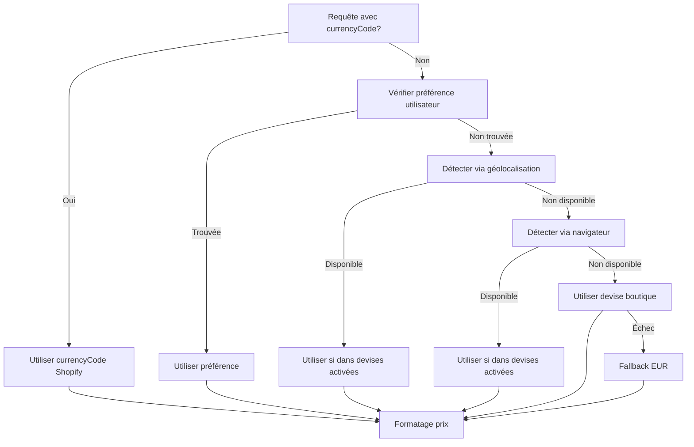

# Gestion Prédictive des Devises — JOLANANAS

> **Objectif** : Système centralisé de gestion des devises utilisant l'API Shopify pour détecter et utiliser automatiquement les bonnes devises dans toute l'application.

**Version** : 1.0.0  
**Date** : Janvier 2025  
**Statut** : Implémenté et opérationnel

---

## 🎯 Vue d'Ensemble

Le système de gestion prédictive des devises permet de :

- ✅ Détecter automatiquement la devise de la boutique Shopify
- ✅ Détecter la devise de l'utilisateur via géolocalisation/navigateur
- ✅ Récupérer les devises activées via Admin API (si multi-currency)
- ✅ Utiliser les `currencyCode` retournés par l'API Shopify en priorité
- ✅ Fournir des fallbacks intelligents si la détection échoue
- ✅ Formater les prix selon la devise détectée

---

## 📦 Architecture

### Structure des Fichiers

```
app/frontend/app/src/
├── lib/
│   └── currency/
│       ├── types.ts              # Types TypeScript
│       └── currencyService.ts    # Service centralisé
├── hooks/
│   └── useCurrency.ts            # Hook React pour client
└── api/
    └── currency/
        └── route.ts              # Route API serveur
```

### Flux de Détection



---

## 🔧 Utilisation

### Côté Client (React)

#### Hook `useCurrency`

```tsx
import { useCurrency } from '@/hooks/useCurrency';

function MyComponent() {
  const { currency, formatPrice, isLoading } = useCurrency();
  
  // Utiliser la devise détectée
  return (
    <div>
      <p>Prix: {formatPrice(29.99)}</p>
      <p>Devise: {currency}</p>
    </div>
  );
}
```

#### Avec currencyCode depuis Shopify (Recommandé)

```tsx
function ProductCard({ product }) {
  // Utiliser le currencyCode de la réponse Shopify en priorité
  const { currency, formatPrice } = useCurrency(
    product.priceRange.minVariantPrice.currencyCode
  );
  
  return (
    <div>
      <p>{formatPrice(product.priceRange.minVariantPrice.amount)}</p>
    </div>
  );
}
```

#### Hook `useProductCurrency` (Recommandé pour les produits)

Pour simplifier l'extraction automatique du `currencyCode` depuis les produits Shopify :

```tsx
import { useProductCurrency } from '@/hooks/useProductCurrency';

function ProductCard({ product }) {
  // Le hook extrait automatiquement le currencyCode depuis le produit
  const { currency, formatPrice } = useProductCurrency(product);
  
  return (
    <div>
      <p>{formatPrice(product.price)}</p>
    </div>
  );
}
```

Le hook `useProductCurrency` :
- ✅ Extrait automatiquement le `currencyCode` depuis `priceRange`, `price`, ou `currency`
- ✅ Passe le `currencyCode` au hook `useCurrency` en priorité
- ✅ Fonctionne avec les types `Product`, `ShopifyProduct`, et `ShopifyVariant`
```

### Côté Serveur (API Routes)

#### Utiliser le service directement

```typescript
import { getCurrency, formatPrice } from '@/lib/currency/currencyService';

export async function GET(request: NextRequest) {
  // Détecter la devise
  const acceptLanguage = request.headers.get('accept-language');
  const currency = await getCurrency(undefined, acceptLanguage);
  
  // Formater un prix
  const formatted = formatPrice(29.99, currency);
  
  return NextResponse.json({ currency, formatted });
}
```

#### Avec currencyCode depuis Shopify

```typescript
import { getCurrency } from '@/lib/currency/currencyService';

export async function POST(request: NextRequest) {
  const { shopifyCurrencyCode } = await request.json();
  
  // Utiliser le currencyCode Shopify en priorité
  const currency = await getCurrency(shopifyCurrencyCode);
  
  return NextResponse.json({ currency });
}
```

### Formatage des Prix

#### Côté Client

```tsx
const { formatPrice, currency } = useCurrency();

// Formatage automatique avec devise détectée
formatPrice(29.99);

// Formatage avec devise spécifique
formatPrice(29.99, 'USD');
```

#### Côté Serveur

```typescript
import { formatPrice } from '@/lib/currency/currencyService';

// Formatage avec devise détectée
const formatted = await formatPrice(29.99);

// Formatage avec devise spécifique
const formatted = formatPrice(29.99, 'USD', 'en-US');
```

---

## 🔍 Méthodes de Détection

### 1. Priorité : currencyCode Shopify

Si un `currencyCode` est fourni dans une réponse Shopify (produit, panier, commande), il est utilisé en priorité avec une confiance de 100%.

**Exemple** :
```typescript
// Dans une réponse GraphQL Shopify
{
  priceRange: {
    minVariantPrice: {
      amount: "29.99",
      currencyCode: "EUR"  // ← Utilisé en priorité
    }
  }
}
```

### 2. Préférence Utilisateur Sauvegardée

Le système vérifie `sessionStorage` et `localStorage` pour une préférence utilisateur sauvegardée.

**Confiance** : 90%

### 3. Géolocalisation

Détection basée sur la locale du navigateur (`navigator.language`) ou le header `Accept-Language`.

**Mapping pays → devise** :
- FR, BE, DE, IT, ES, NL, PT, AT, IE, FI, GR, LU → EUR
- US → USD
- GB → GBP
- CA → CAD
- etc.

**Confiance** : 80%

### 4. Détection Navigateur

Utilisation de l'API `Intl` du navigateur pour détecter la locale et mapper vers une devise.

**Confiance** : 75%

### 5. Devise de la Boutique Shopify

Récupération de la devise configurée dans Shopify via `shop.paymentSettings.currencyCode`.

**Confiance** : 70%

### 6. Fallback Final

Si toutes les méthodes échouent, utilisation de `EUR` comme fallback absolu.

**Confiance** : 50%

---

## 🌍 Support Multi-Currency

### Vérification

```typescript
import { currencyService } from '@/lib/currency/currencyService';

const isMultiCurrency = await currencyService.isMultiCurrencyEnabled();
```

### Récupération des Devises Disponibles

```typescript
import { getAvailableCurrencies } from '@/lib/currency/currencyService';

const currencies = await getAvailableCurrencies();
// Retourne : [{ code: 'EUR', rate: 1.0 }, { code: 'USD', rate: 1.1 }, ...]
```

### Via Admin API

Si l'Admin API est disponible, les devises activées sont récupérées via :

```
GET /admin/api/{version}/currencies.json
```

**Réponse** :
```json
{
  "currencies": [
    {
      "currency": "EUR",
      "rate_updated_at": "2025-01-15T10:00:00Z"
    },
    {
      "currency": "USD",
      "rate_updated_at": "2025-01-15T10:00:00Z"
    }
  ]
}
```

---

## 🔌 Intégration avec l'API Shopify

### Storefront API

Le système utilise automatiquement les `currencyCode` retournés par les requêtes GraphQL :

- `product.priceRange.minVariantPrice.currencyCode`
- `variant.price.currencyCode`
- `cart.cost.totalAmount.currencyCode`
- `shop.paymentSettings.currencyCode`

### Admin API

Si disponible, le système récupère les devises activées via :

```typescript
import { ShopifyAdminClient } from '@/lib/ShopifyAdminClient';

const adminClient = new ShopifyAdminClient();
const response = await adminClient.getEnabledCurrencies();
```

---

## 🎯 Utilisation Systématique des currencyCode Shopify

### Principe Fondamental

**Les `currencyCode` retournés par l'API Shopify doivent TOUJOURS être utilisés en priorité absolue.** C'est la source de vérité la plus fiable car elle reflète exactement la devise utilisée par Shopify pour les calculs de prix.

### Helpers d'Extraction

Le système fournit des helpers spécialisés pour extraire le `currencyCode` depuis différents types de données Shopify :

```typescript
import {
  extractCurrencyFromProduct,
  extractCurrencyFromVariant,
  extractCurrencyFromCart,
  extractCurrencyFromCartLine,
  extractCurrencyFromPriceRange,
  extractCurrencyFromMoney,
  extractCurrency, // Fonction générique
} from '@/lib/currency/helpers';
```

#### Exemples d'Utilisation

**Depuis un Produit** :
```typescript
import { extractCurrencyFromProduct } from '@/lib/currency/helpers';
import type { ShopifyProduct } from '@/lib/shopify/types';

const currencyCode = extractCurrencyFromProduct(shopifyProduct);
// Retourne 'EUR', 'USD', etc. ou undefined
```

**Depuis une Variante** :
```typescript
import { extractCurrencyFromVariant } from '@/lib/currency/helpers';

const currencyCode = extractCurrencyFromVariant(variant);
```

**Depuis un Panier** :
```typescript
import { extractCurrencyFromCart } from '@/lib/currency/helpers';

const currencyCode = extractCurrencyFromCart(cart);
```

**Fonction Générique** :
```typescript
import { extractCurrency } from '@/lib/currency/helpers';

// Fonctionne avec n'importe quel type Shopify
const currencyCode = extractCurrency(data);
```

### Méthode d'Extraction dans CurrencyService

Le service centralisé fournit également une méthode d'extraction générique :

```typescript
import { extractCurrencyFromShopifyResponse } from '@/lib/currency/currencyService';

// Supporte : Product, Variant, Cart, PriceRange, Money, etc.
const currencyCode = extractCurrencyFromShopifyResponse(shopifyData);
```

### Validation des Devises

Avant d'utiliser un `currencyCode`, le système le valide automatiquement :

```typescript
import { validateCurrency } from '@/lib/currency/currencyService';

const isValid = await validateCurrency('EUR');
// Vérifie :
// - Format valide (3 caractères)
// - Disponibilité dans les devises activées (si multi-currency)
// - Retourne true si multi-currency désactivé (toutes devises acceptées)
```

### Bonnes Pratiques

#### ✅ À FAIRE

1. **Toujours extraire le `currencyCode` depuis les réponses Shopify** :
   ```tsx
   const { formatPrice, currency } = useCurrency(
     product.priceRange?.minVariantPrice?.currencyCode
   );
   ```

2. **Utiliser `useProductCurrency` pour les produits** :
   ```tsx
   const { formatPrice, currency } = useProductCurrency(product);
   ```

3. **Passer le `currencyCode` au hook `useCurrency`** :
   ```tsx
   const { formatPrice } = useCurrency(shopifyCurrencyCode);
   ```

4. **Utiliser les helpers d'extraction** :
   ```typescript
   const currencyCode = extractCurrencyFromProduct(product);
   ```

#### ❌ À ÉVITER

1. **Ne pas ignorer les `currencyCode` Shopify** :
   ```tsx
   // ❌ MAUVAIS
   const { formatPrice } = useCurrency(); // Sans currencyCode
   
   // ✅ BON
   const { formatPrice } = useCurrency(product.priceRange?.minVariantPrice?.currencyCode);
   ```

2. **Ne pas utiliser `product.currency` directement sans validation** :
   ```tsx
   // ❌ MAUVAIS (si disponible, utiliser le currencyCode depuis priceRange)
   {product.price.toFixed(2)} {product.currency}
   
   // ✅ BON
   {formatPrice(product.price, currency)}
   ```

3. **Ne pas formater manuellement les prix** :
   ```tsx
   // ❌ MAUVAIS
   {parseFloat(price.amount).toFixed(2)} {price.currencyCode}
   
   // ✅ BON
   {formatPrice(parseFloat(price.amount), currency)}
   ```

### Migration des Composants

Tous les composants de produits ont été migrés pour utiliser systématiquement les `currencyCode` Shopify :

- ✅ `ProductOverview` : Utilise `useProductCurrency` avec extraction depuis `priceRange`
- ✅ `ProductQuickView` : Utilise `useProductCurrency` avec extraction depuis `price`
- ✅ `ProductCard` : Utilise `useCurrency` avec `currencyCode` depuis `variant.price`
- ✅ `ProductInfo` : Utilise `useProductCurrency` avec extraction automatique
- ✅ `SimpleProductCard` : Utilise `useCurrency` avec `currencyCode` depuis `variant.price`

### Logging et Débogage

Le service de devises inclut un logging structuré pour le débogage (activé en mode développement) :

```typescript
// Les logs incluent :
// - Extraction de currencyCode depuis réponses Shopify
// - Validation des devises
// - Détection et fallbacks
// - Utilisation du cache
```

Les logs sont formatés en JSON pour faciliter l'analyse et le débogage.

---

## 📝 Exemples d'Utilisation

### Exemple 1 : Composant Produit

```tsx
'use client';

import { useCurrency } from '@/hooks/useCurrency';

export function ProductCard({ product }) {
  // Utiliser le currencyCode de Shopify en priorité
  const { formatPrice } = useCurrency(
    product.priceRange.minVariantPrice.currencyCode
  );
  
  return (
    <div>
      <h3>{product.title}</h3>
      <p className="price">
        {formatPrice(product.priceRange.minVariantPrice.amount)}
      </p>
    </div>
  );
}
```

### Exemple 2 : Route API avec Détection

```typescript
import { NextRequest, NextResponse } from 'next/server';
import { getCurrency } from '@/lib/currency/currencyService';

export async function GET(request: NextRequest) {
  const acceptLanguage = request.headers.get('accept-language');
  const currency = await getCurrency(undefined, acceptLanguage);
  
  return NextResponse.json({ currency });
}
```

### Exemple 3 : Sauvegarde de Préférence

```tsx
'use client';

import { useCurrency } from '@/hooks/useCurrency';

export function CurrencySelector() {
  const { currency, setCurrency, availableCurrencies } = useCurrency();
  
  return (
    <select 
      value={currency} 
      onChange={(e) => setCurrency(e.target.value)}
    >
      {availableCurrencies.map((curr) => (
        <option key={curr.code} value={curr.code}>
          {curr.code}
        </option>
      ))}
    </select>
  );
}
```

---

## 🎛️ Configuration

### Service de Devises

```typescript
import { CurrencyService } from '@/lib/currency/currencyService';

const service = new CurrencyService({
  defaultCurrency: 'EUR',        // Devise par défaut
  cacheDuration: 3600000,        // Cache 1 heure
  enableAutoDetection: true,     // Activer détection auto
  enableMultiCurrency: true,     // Activer multi-currency
});
```

### Route API

La route `/api/currency` accepte :

**Query params** :
- `shopifyCurrencyCode` : Code de devise depuis Shopify (priorité)

**Headers** :
- `Accept-Language` : Pour détection de locale (ex: "fr-FR,fr;q=0.9,en;q=0.8")

**Réponse** :
```json
{
  "currency": "EUR",
  "shopCurrency": "EUR",
  "availableCurrencies": [
    { "code": "EUR", "name": "Euro", "symbol": "€" },
    { "code": "USD", "name": "US Dollar", "symbol": "$" }
  ],
  "isMultiCurrencyEnabled": true,
  "detectedFrom": "shopify-response"
}
```

---

## 🔄 Cache et Performance

### Cache Côté Serveur

- **Devise boutique** : 1 heure (revalidation)
- **Devises activées** : 1 heure
- **Headers HTTP** : `Cache-Control: public, s-maxage=3600, stale-while-revalidate=7200`

### Cache Côté Client

- **SessionStorage** : Préférence utilisateur
- **LocalStorage** : Préférence persistante
- **Hook useCurrency** : Cache automatique avec revalidation

### Invalidation

```typescript
import { currencyService } from '@/lib/currency/currencyService';

// Invalider le cache
currencyService.clearCache();
```

---

## ⚠️ Gestion des Erreurs

### Erreurs API Shopify

Si l'API Shopify est indisponible :
- Utilisation du cache si disponible
- Fallback vers devise boutique en cache
- Fallback final : EUR

### Erreurs de Détection

Si la détection échoue :
- Utilisation de la devise de la boutique
- Fallback final : EUR

### Logs

En développement, tous les logs sont détaillés :
- ✅ Succès de détection
- ⚠️ Avertissements (fallbacks)
- ❌ Erreurs critiques

---

## 🧪 Tests

### Tests Unitaires

```typescript
import { currencyService } from '@/lib/currency/currencyService';

describe('CurrencyService', () => {
  it('should detect currency from shopify response', async () => {
    const result = await currencyService.detectUserCurrency('USD');
    expect(result.currency).toBe('USD');
    expect(result.source).toBe('shopify-response');
  });
  
  it('should fallback to shop currency', async () => {
    const result = await currencyService.detectUserCurrency();
    expect(result.currency).toBeDefined();
  });
});
```

### Tests d'Intégration

Les tests vérifient :
- Détection via API Shopify
- Détection via géolocalisation
- Détection via navigateur
- Fallbacks
- Formatage des prix

---

## 📚 Références API

### Shopify Storefront API

- **Shop Info** : `shop.paymentSettings.currencyCode`
- **Products** : `product.priceRange.minVariantPrice.currencyCode`
- **Cart** : `cart.cost.totalAmount.currencyCode`

### Shopify Admin API

- **Currencies** : `GET /admin/api/{version}/currencies.json`

### Documentation Officielle

- [Shopify Storefront API - Money](https://shopify.dev/docs/api/storefront/latest/objects/Money)
- [Shopify Admin API - Currency](https://shopify.dev/docs/api/admin-rest/latest/resources/currency)

---

## ✅ Checklist de Migration

Pour migrer un composant existant :

- [ ] Importer `useCurrency` (client) ou `getCurrency` (serveur)
- [ ] Remplacer `currency = 'EUR'` par `currency = useCurrency().currency` ou `await getCurrency()`
- [ ] Utiliser `formatPrice()` du hook/service au lieu de `Intl.NumberFormat` manuel
- [ ] Passer `currencyCode` depuis réponse Shopify si disponible
- [ ] Tester avec différentes devises
- [ ] Vérifier les fallbacks

---

## 🚀 Améliorations Futures

- [ ] Support de la conversion de devises en temps réel
- [ ] Interface utilisateur pour changer de devise
- [ ] Synchronisation avec préférences utilisateur Shopify
- [ ] Cache distribué (Redis) pour production
- [ ] Analytics sur les devises utilisées

---

**Ce système garantit que toutes les devises sont détectées et utilisées automatiquement selon les capacités de l'API Shopify.**

